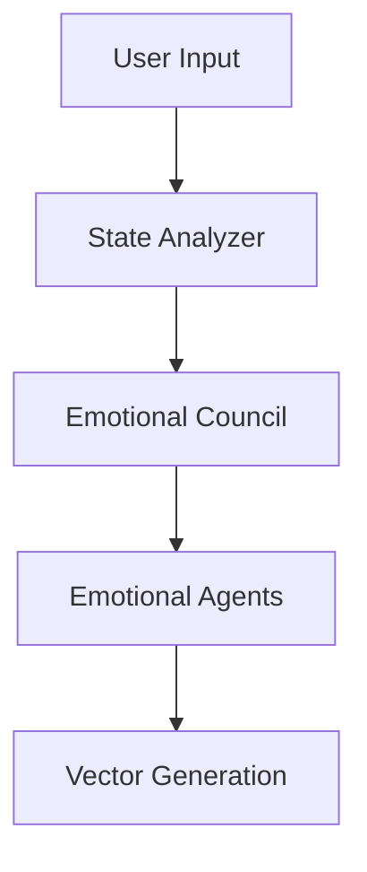

# Enhanced Control Vector System Architecture

## System Overview

The system implements an emotionally-aware conversational AI that uses control vectors to manage emotional states and personality traits. The architecture combines emotional agents, psychological theories, and dynamic state management through vector spaces.

## Core Components

### 1. Emotional Council
```python
class EmotionalCouncil:
    def __init__(
        self,
        emotional_agents: List[EmotionalAgent],
        llm_config: dict,
        persona_name: str
    ):
        self.agents = {agent.emotion: agent for agent in emotional_agents}
        self.vector_manager = VectorManager()
        self.current_controller = None
```

The Emotional Council:
- Manages emotional agent interactions
- Orchestrates control vector combinations
- Handles state transitions
- Maintains emotional coherence

### 2. Emotional Agents

Each emotional agent maintains:
- Base emotional control vector
- Current state and influence level
- Vector modification capabilities
- Memory of past states

```python
class EmotionalAgent:
    def __init__(
        self,
        name: str,
        emotion: EmotionalState,
        personality: PersonalityTraits,
        llm_config: dict
    ):
        self.control_vector = self._initialize_control_vector()
        self.state = AgentState()
        self.vector_history = []
```

### 3. Control Vector System

#### 3.1 Vector Generation
```python
class ControlVectorGenerator:
    def generate_vector(
        self,
        emotional_responses: List[EmotionalResponse],
        theory_validations: List[TheoryValidation],
        context: Dict
    ) -> np.ndarray:
        # Combine emotional and theory vectors
        emotional_vector = self._get_emotional_vector(emotional_responses)
        theory_vector = self._get_theory_vector(theory_validations)
        
        # Apply context and time-based modifications
        return self._combine_vectors(emotional_vector, theory_vector, context)
```

#### 3.2 Vector Components
Each control vector includes:
- Base emotional bias
- Personality influence
- Temporal dynamics
- Context modifications

## Processing Flow

### 1. Input Processing



1. State Analyzer processes user input
2. Emotional Council distributes to agents
3. Each agent generates emotional response
4. Control vectors combine for final state

### 2. Vector Processing

Each emotional agent:
1. Starts with base control vector
2. Modifies based on current state
3. Applies personality influence 
4. Adds temporal dynamics
5. Integrates context

### 3. Response Generation

The system generates responses by:
1. Combining emotional vectors
2. Applying theory validation
3. Integrating memory context
4. Generating coherent output

## Memory Integration

### 1. Vector Storage
```python
class VectorStorageSystem:
    def store_vector(
        self,
        memory_id: str,
        control_vector: np.ndarray,
        context: Dict
    ):
        self.vectors[memory_id] = {
            "vector": control_vector,
            "timestamp": datetime.now(),
            "context": context
        }
```

### 2. State History
- Tracks emotional transitions
- Stores vector evolution
- Maintains relationship context

## Emotional State Management

### 1. State Transitions

```python
class StateManager:
    def update_state(
        self,
        control_vector: np.ndarray,
        context: Dict
    ) -> Dict:
        # Apply time decay
        self._apply_decay()
        
        # Update with new vector
        new_state = self._combine_states(control_vector)
        
        # Store history
        self._update_history(new_state)
        
        return new_state
```

### 2. Vector Combination
- Weighted by agent influence
- Modified by context
- Adjusted for time
- Validated by theories

## Response Generation

### 1. Vector-Aware Generation
```python
class ResponseGenerator:
    async def generate_response(
        self,
        message: str,
        control_vector: np.ndarray,
        context: Dict
    ) -> str:
        # Modify LLM config with control vector
        config = self._modify_config(control_vector)
        
        # Generate response
        return await self._generate(message, config)
```

### 2. Context Integration
- Emotional state context
- Relationship history
- Memory integration
- Theory guidance

## Implementation Details

### 1. Vector Operations

```python
def normalize_vector(vector: np.ndarray) -> np.ndarray:
    """Normalize vector to unit length"""
    norm = np.linalg.norm(vector)
    if norm == 0:
        return vector
    return vector / norm

def combine_vectors(
    vectors: List[np.ndarray],
    weights: List[float]
) -> np.ndarray:
    """Combine multiple vectors with weights"""
    combined = np.zeros_like(vectors[0])
    for vector, weight in zip(vectors, weights):
        combined += vector * weight
    return normalize_vector(combined)
```

### 2. State Updates

```python
def update_agent_state(
    agent: EmotionalAgent,
    control_vector: np.ndarray,
    context: Dict
) -> None:
    """Update agent state with new control vector"""
    # Calculate vector similarity
    similarity = cosine_similarity(
        agent.control_vector,
        control_vector
    )
    
    # Update influence based on similarity
    agent.state.influence *= similarity
    
    # Apply time decay
    agent.state.energy *= 0.9  # 10% decay
    
    # Store vector history
    agent.vector_history.append({
        "timestamp": datetime.now(),
        "vector": control_vector,
        "similarity": similarity
    })
```

## Benefits

1. **Natural Transitions**
- Smooth emotional changes
- Coherent personality
- Context-aware responses

2. **Fine-Grained Control**
- Precise emotional expression
- Nuanced personality traits
- Adaptive behavior

3. **Memory Integration**
- Historical context
- Relationship development
- Pattern learning

## Extensions

1. **Enhanced Vector Spaces**
- Hierarchical emotions
- Complex personality traits
- Dynamic theory integration

2. **Advanced Memory**
- Pattern recognition
- Emotional learning
- Relationship modeling

3. **Optimization**
- Vector caching
- Efficient combination
- State prediction

## Usage Example

```python
# Initialize system
council = EmotionalCouncil(emotional_agents, llm_config)

# Process message
async def process_message(message: str, context: Dict) -> str:
    # Analyze input
    analysis = await state_analyzer.analyze(message)
    
    # Get emotional responses
    responses = await council.process_message(
        message,
        analysis,
        context
    )
    
    # Generate control vector
    control_vector = vector_generator.generate_vector(
        responses,
        context
    )
    
    # Generate response
    return await response_generator.generate_response(
        message,
        control_vector,
        context
    )
```

The architecture provides a robust foundation for emotionally-intelligent AI interactions while maintaining flexibility for future enhancements.