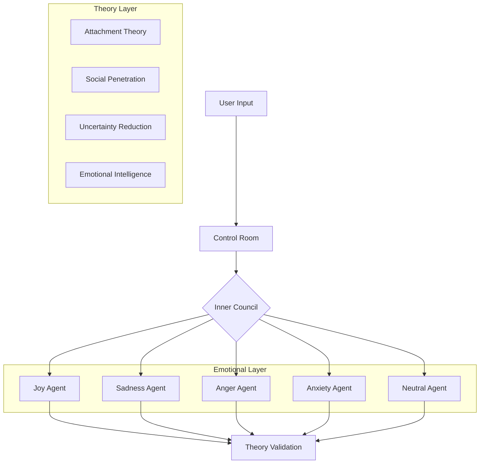

# Adaptive Personality AI System: Technical Deep Dive

## Project Philosophy

This system implements an AI character with genuine psychological depth, moving beyond simple response generation to create an agent capable of emotional growth, relationship development, and adaptive personality formation. The architecture draws from several key theories and approaches:

1. **Marvin Minsky's Society of Mind**: The emotional architecture implements a "society" of specialized agents that collaborate and compete to generate responses, similar to how different aspects of human personality interact.

2. **Memory Consolidation Theory**: The memory system uses embedding-based clustering to naturally form psychological patterns, mimicking how human experiences consolidate into personality traits and behavioral tendencies.

3. **Developmental Psychology**: Rather than hard-coding personality traits, the system develops adaptations and patterns through experience, allowing for organic psychological growth.

## Core Architecture

### 1. Multi-Agent Emotional System

The emotional system uses AutoGen's group chat capabilities to implement a "society of mind" approach where different emotional aspects collaborate and compete for control.

```python
class EmotionalCouncil:
    """Manages emotional agent discussions and response generation"""
    
    def __init__(
        self,
        emotional_agents: List[EmotionalAgent],
        llm_config: dict,
        persona_name: str
    ):
        # Initialize AutoGen group chat
        self.group_chat = autogen.GroupChat(
            agents=emotional_agents,
            messages=[],
            max_round=len(agents),
            speaker_selection_method="round_robin",
            allow_repeat_speaker=False
        )
```

#### Why This Approach?
- Allows for complex emotional interactions
- Creates more nuanced and authentic responses
- Enables emotional growth through experience
- Maintains psychological coherence

### 2. Theory Integration

The system integrates multiple psychological theories through specialized agents that validate and guide interactions:

```python
class TheoryAgent(autogen.AssistantAgent):
    """Base class for psychological theory agents"""
    
    def __init__(
        self,
        name: str,
        theory_name: str,
        principles: List[str],
        guidelines: List[str],
        llm_config: dict
    )
```

Currently implemented theories:
1. **Attachment Theory**
   - Guides relationship formation
   - Influences trust development
   - Shapes emotional availability

2. **Social Penetration Theory**
   - Controls disclosure depth
   - Manages relationship progression
   - Guides intimacy development

3. **Uncertainty Reduction Theory**
   - Manages information seeking
   - Guides predictability building
   - Controls anxiety management

4. **Emotional Intelligence Theory**
   - Shapes emotional awareness
   - Guides emotional regulation
   - Enhances empathetic response

### 3. Memory and Adaptation System

The system uses a sophisticated memory architecture that allows for natural pattern formation and personality development:

```python
class MemoryStorageSystem:
    """Memory management with embedding support"""
    
    def __init__(self, llm_config: dict):
        self.memoripy_manager = MemoryManager(
            api_key=llm_config.get("api_key"),
            chat_model="openai",
            embedding_model="openai",
            storage=JSONStorage("memory_storage.json")
        )
```

#### Memory Types
1. **Emotional Memories**
   ```python
   @dataclass
   class EmotionalMemory:
       id: str
       timestamp: datetime
       content: str
       emotion: EmotionalState
       valence: EmotionalValence
       intensity: EmotionalIntensity
       context: Dict
       impact_scores: Dict[str, float]
   ```

2. **Experience Patterns**
   ```python
   @dataclass
   class AdaptationCluster:
       centroid: ndarray          # Cluster center in embedding space
       member_ids: List[str]      # Experience IDs in cluster
       stability: float          # Cluster stability measure
       formation_time: datetime
   ```

### 4. State Management and Context

The system maintains sophisticated state tracking:

```python
@dataclass
class CharacterState:
    trust_level: float  # 0-100
    emotional_state: EmotionalState
    self_disclosure_level: float  # 0-100
    interest_alignment: float  # 0-100
    emotional_intelligence: float  # 0-100
    attachment_style: AttachmentStyle
    personality_traits: PersonalityTraits
```

## Implementation Details

### 1. Processing Flow



### 2. Memory Architecture

The memory system uses DBSCAN clustering to form natural patterns:

```python
def _run_clustering(
    self,
    embeddings: List[np.ndarray]
) -> np.ndarray:
    clustering = DBSCAN(
        eps=0.3,
        min_samples=3,
        metric='cosine'
    ).fit(np.vstack(embeddings))
    return clustering.labels_
```

Key features:
- Natural pattern emergence
- Experience-based learning
- Dynamic adaptation formation
- Memory consolidation

### 3. Response Generation

Response generation integrates multiple components:

```python
async def generate_response(
    self,
    message: str,
    context: Dict,
    active_clusters: List[AdaptationCluster]
) -> str:
    # Get relevant memories and patterns
    relevant_memories = await self._get_relevant_memories(message)
    active_patterns = self._get_active_patterns(
        relevant_memories,
        active_clusters
    )
    
    # Generate response considering patterns
    response = await self.llm.generate_response(
        message=message,
        memories=relevant_memories,
        patterns=active_patterns,
        context=context
    )
```

## Advanced Usage Examples

### 1. Custom Emotional Configuration

```python
# Configure emotional tendencies
emotional_config = {
    "joy": {
        "base_influence": 0.7,
        "decay_rate": 0.1,
        "recovery_rate": 1.5
    },
    "sadness": {
        "base_influence": 0.5,
        "decay_rate": 0.15,
        "recovery_rate": 1.2
    }
}

# Initialize system with custom configuration
system = IntegratedSystem(
    config=SystemConfig(
        llm_config=llm_config,
        emotional_config=emotional_config
    )
)
```

### 2. Memory Pattern Analysis

```python
# Analyze emerging patterns
patterns = await system.memory_manager.analyze_patterns(
    timeframe=timedelta(days=7),
    min_stability=0.7
)

# Get pattern manifestations
manifestations = await system.memory_manager.get_pattern_manifestations(
    patterns=patterns,
    context=current_context
)
```

### 3. Theory Integration Customization

```python
# Configure theory weights
theory_config = {
    "attachment": {
        "weight": 0.8,
        "active_principles": ["secure_base", "emotional_availability"]
    },
    "social_penetration": {
        "weight": 0.6,
        "active_principles": ["disclosure_depth", "reciprocity"]
    }
}
```

## Development Guidelines

### 1. Code Organization

```plaintext
src/
├── emotions/
│   ├── base_emotion_agent.py
│   ├── joy_agent.py
│   └── ...
├── theories/
│   ├── base_theory_agent.py
│   ├── attachment_agent.py
│   └── ...
├── memory/
│   ├── memory_system.py
│   ├── pattern_formation.py
│   └── ...
└── core/
    ├── control_room.py
    ├── state_management.py
    └── response_generation.py
```

### 2. Testing Strategy

Comprehensive testing across multiple layers:

1. **Unit Tests**
   ```python
   def test_emotional_processing():
       emotion = EmotionalAgent(...)
       response = await emotion.process_message(...)
       assert response.confidence >= 0.5
   ```

2. **Integration Tests**
   ```python
   def test_pattern_formation():
       system = IntegratedSystem(...)
       for experience in test_experiences:
           await system.process_experience(experience)
       patterns = system.get_active_patterns()
       assert len(patterns) > 0
   ```

3. **Psychological Tests**
   ```python
   def test_theory_compliance():
       system = IntegratedSystem(...)
       response = await system.process_message(...)
       theory_scores = await system.theory_council.evaluate(response)
       assert all(score > 0.7 for score in theory_scores.values())
   ```

## Performance Considerations

### 1. Memory Optimization

The system uses several strategies to manage memory efficiently:

```python
class MemoryOptimizer:
    def __init__(self):
        self.cache = LRUCache(maxsize=1000)
        self.embeddings = {}
    
    async def optimize_storage(self):
        # Consolidate similar memories
        clusters = await self._find_clusters()
        consolidated = await self._merge_clusters(clusters)
        
        # Update embeddings
        self.embeddings = await self._update_embeddings(consolidated)
```

### 2. Response Generation Optimization

```python
class ResponseOptimizer:
    def __init__(self):
        self.response_cache = {}
        self.pattern_cache = {}
    
    async def optimize_generation(
        self,
        message: str,
        context: Dict
    ) -> str:
        # Check cache for similar messages
        cache_key = self._generate_cache_key(message, context)
        if cache_key in self.response_cache:
            return self._adapt_cached_response(
                self.response_cache[cache_key],
                context
            )
```

## Future Directions

### 1. Enhanced Pattern Recognition
- Implement hierarchical clustering
- Add sub-pattern detection
- Improve pattern relationships
- Track pattern evolution

### 2. Advanced Analysis
- Deepen psychological understanding
- Improve pattern recognition
- Enhance adaptation tracking
- Refine behavioral manifestation

### 3. System Optimization
- Optimize embedding operations
- Improve clustering efficiency
- Enhance pattern activation
- Refine response generation

## References

1. Minsky, M. (1986). The Society of Mind
2. Bowlby, J. (1969). Attachment and Loss
3. Altman & Taylor (1973). Social Penetration Theory
4. Berger & Calabrese (1975). Uncertainty Reduction Theory